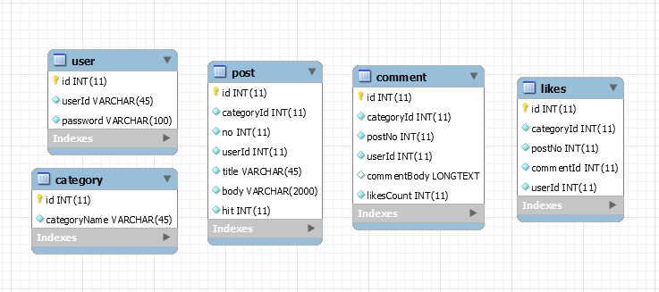
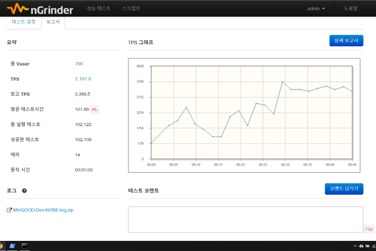

# Spring Boot + MyBatis + Security

---

### Api Manual
* [PostCommentController](./apidoc/PostCommentController.md)
* [PostController](./apidoc/PostController.md)
* [CommentContoller](./apidoc/CommentController.md)
* [LikesController](./apidoc/LikesController.md)

---

### Database 구조

---

### 성능테스트

---

### 사용된 도구
* Spring Boot + MyBatis : CRUD 게시판 구현
* Security : 사용자 권한 (로그인 구현)
* Maven - 의존성 관리 프로그램
* Redis : 일정 조회수 이상의 글 따로 저장 및 갱신
* EHCache : 게시판 전체 목록 조회 성능 개선 테스트
* MySQL : 주 데이터베이스
* Tomcat : 웹 애플리케이션 서버
* Postman & Postman Interceptor : 테스트

## 기타 메모
### GET 방식과 POST 방식에 대한 상식 ?
* **POST 방식이 GET 방식보다 보안 측면에서 더 좋다 ?**
    * POST든 GET이든 보내는 데이터는 전부 클라이언트 측에서 볼수 있다. 단지 GET 방식은 URL에 데이터가 표시되어 별다른
    노력없이 볼 수 있는 것 뿐이다. 두 방식 모두 보안을 생각한다면 암호화해야 한다.
* **GET 방식이 POST 방식보다 빠르다 ?**
    * 빠르다. 그 이유는 GET 방식의 요청은 Caching(한번 접근 후, 또 요청할 시 빠르게 접근하기 위해 데이터를 저장)때문에 
    빠른 것이다.

### 저자
* **조민국** - [MinGOODdev](https://github.com/MinGOODdev)

### 감사 인사

* [Redis 저장소에 CRUD 로직 구현하기](http://jsonobject.tistory.com/390?category=787905)
* [Spring Boot에서 Redis 사용하기](http://kingbbode.tistory.com/25)
* [EHCache를 이용한 Cache 구현](http://javacan.tistory.com/entry/133)

---

